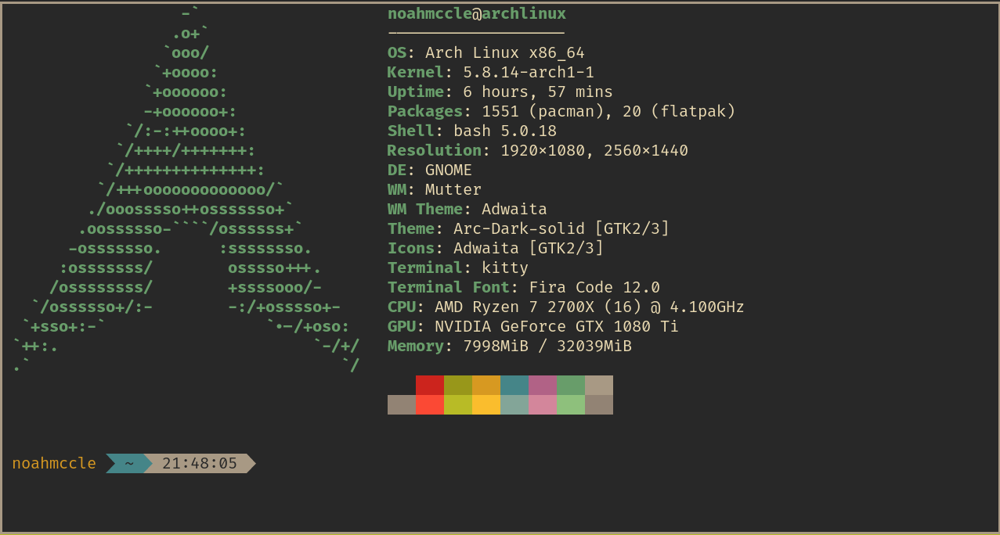

# Dotfiles

Contains my personal dotfiles for my Arch Linux installation. This repository is intended to be cloned bare with the working tree set to $HOME without showing untracked files. This makes OS configuration as portable as possible.



# Table of Contents

- [Packages](#packages)
  - [Backup](#backup)
  - [Restore all official packages](#restore-all-official-packages)
- [Setup](#setup)
- [Example Usage](#example-usage)
- [Update Submodules](#update-submodules)
- [SSH and Git Config](#ssh-and-git-config)

## Packages


Package lists for pacman and yay can be found in .pkglist.

### Backup

```bash
pacman -Qqe > $HOME/.pkg-list/pacman-all
```

### Restore all official packages

```bash
pacman -S --needed - < $HOME/.pkg-list/pacman-all
```

## Setup

```bash
git clone --bare git@github.com:Mahooki/dotfiles.git $HOME/.dotfiles
alias dotfiles='/usr/bin/git --git-dir=$HOME/.dotfiles/ --work-tree=$HOME'
dotfiles config status.showUntrackedFiles no
dotfiles checkout
```

## Example Usage

```bash
dotfiles status
dotfiles add .vimrc
dotfiles commit -m "Add vimrc"
dotfiles push
```

Keep file but remove from repository:

```bash
dotfiles rm --cached ~/.some_file
```

## Update Submodules

```bash
dotfiles submodule update --recursive --remote
```

## SSH and Git Config

I have checked in my personal [~/.ssh/config](.ssh/config) with local hostnames. Remove if you are not me :)

My [~/.gitconfig](.gitconfig) switches the git user and ssh key depending on the file path of the repository.
Anything repositories under `~/personal` will use [~/.gitconfig-personal](.gitconfig-personal) and any under `~/work`
will use [~/.gitconfig-work](.gitconfig-work).

__This configuration expect these two ssh keys to be present__:
- `~/.ssh/id_rsa_personal`
- `~/.ssh/id_rsa_work`
